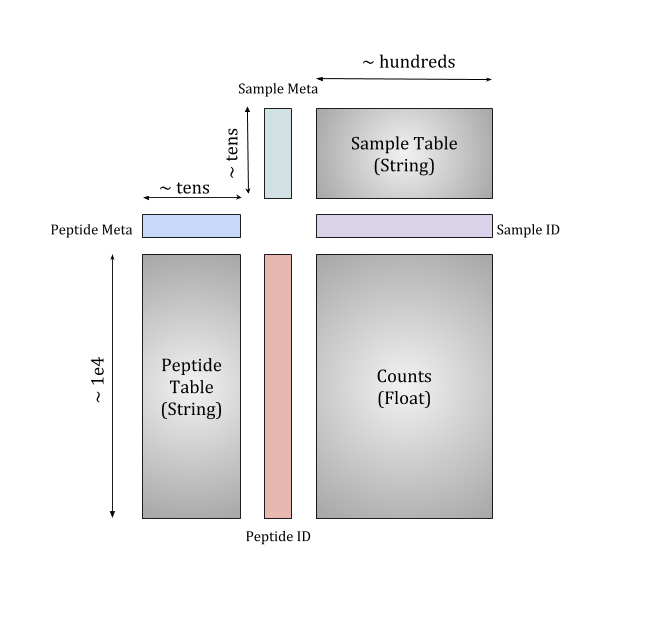
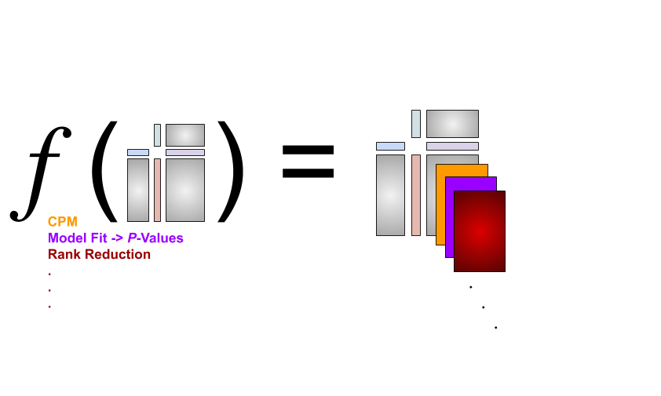

# Phippery

<p>
  
</p>

[](https://github.com/psf/black)
[](https://quay.io/repository/matsengrp/phippery)
[](https://github.com/matsengrp/phippery/blob/master/.github/workflows/build-and-test.yaml)


## What is this?

**In short,**

[Phage Immunoprecipitation Sequencing](https://www.nature.com/articles/s41596-018-0025-6)
(PhIP-Seq)
Is a powerful protocol for investigating antibody binding specificities and potential pathogen epitopes.
This package provides a few tools to help collect data coming from a Nextflow pipeline seen
[here](https://github.com/matsengrp/phip-flow).
This code provides a set of tools to organize, slice, and query data from PhIP-Seq style enrichment matrices in
a an effecient manner centered around the [xarray](http://xarray.pydata.org/en/stable/) infrastructure.

## How do I install it?

To install the API and command-line scripts at the moment,
it is suggested you clone the repository, create a conda
environment from `environment.yml`, and run the tests to make
sure everything is working properly.

```
git clone https://github.com/matsengrp/phippery.git
cd phippery
conda env create -f environment.yml #follow prompts
conda activate phippery
```

install by
```
pip install .
```

Then run the tests:
```
pytest
```

## Motivation

The primary data strucure resulting from PhIP-Seq experiments is an _enrichment matrix_, X
with i rows and j columns. Commonly, row index represents a peptide that is displayed on a phage,
and each column represents a sample that was mixed with the entire phage library. After sequencing and
demultiplexing each sample, we align the reads to the oligonucleotide reference library to observe a
count of aligned reads to each peptide.

Outside of the enrichment matrix, each _sample_ and _peptide_
have a slew of metadata associated with it that become very important for various computing
tasks like model fitting, normalizing, and differential selection.
Additionally, the comparison across groups of virus proteins and sample types is crucial in many experiments.
For large sample size experiments, it can be difficult to cross reference each of these groups before and
after analysis. Here, we take advantage of the powerful [xarray](http://xarray.pydata.org/en/stable/)
approach to organizing all the Phip-Seq data along four primary coordinate dimensions which tie all
sample/peptide enrichments to the respective annotations. Doing this allows us to store all the
information without the error prone step of cross-checking separate dataframes, and without the
large storage scaling of using "Tall" dataframes.

<p align="center">
  
</p>

Using the tools here, we propose the following protocol to performing data analysis and visualization:

    1 Use the phip-flow pipeline to create the xarray dataset.
    2 Stack enrichment analysis values on "top" of the raw counts.
    3 Slice the dataset to the sample/peptide groups you'd like visualize
    4 Transform the data subset into tidy format for plotting

<p align="center">
  
</p>


## CLI

`phippery` uses
[click](https://click.palletsprojects.com/en/7.x/) as a CLI manager. This means
that phippery has nested help pages for each command available.

```
Usage: phippery [OPTIONS] COMMAND [ARGS]...

  Some tools for PhIP-Seq data analysis. For help with a specific command,
  type phippery COMMAND -h

Options:
  -h, --help  Show this message and exit.

Commands:
  collect-phip-data    Collect sample and peptide metadata tables along
                       with...

  peptide-md-to-fasta  convert peptide metadata to fasta format.
```

