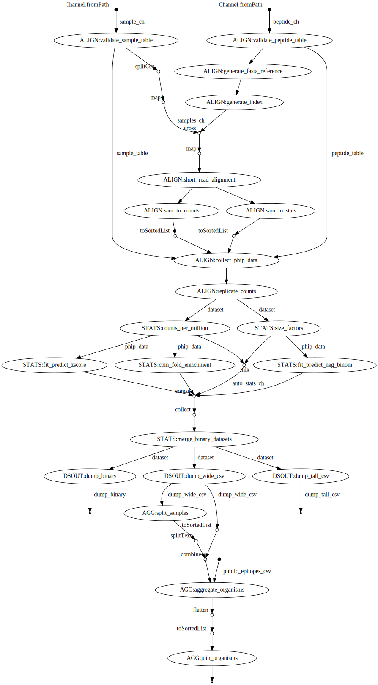

.. _sec_pipeline_intro:

===================
Alignments Pipeline
===================

A flexible `Nextflow automated pipeline <https://www.nextflow.io/>`_ 
used for producing the 
`raw enrichment data <TODO>`_ when provided 
Next Generations Sequencing (demultiplexed `fastq files <TODO>`_) data, 
as well as coupled `sample and peptide library annotation files <TODO>`_ 
files, as input.

The ``PhIP-Flow`` pipeline :ref:`inputs <sec_pipe_inputs>` are 
just two CSV files with only a single column
requirement in each. 
Concretely, the pipeline requires that a user specifies; 
(1) a sample annotation table, which (at a minimum) must include a column header"*fastq_filename*",
with each respective row providing a path (relative to workflow launch) to each sample in the study.
(2) a peptide annotation table, which (at a minimum) must include the column header, "*oligo*",
with each of it's respective rows providing the oligonucleotide encoding for each peptide in the
phage library used.
The default workflow then performs all of the major steps in processing the raw data and 
obtaining a enrichment dataset (along with some other statistical goodies).
The pipeline will output a pickle dump'd ``Xarray DataSet``, or optionally
two common CSV formats, tall and wide for the user to query with 
their own favorite analysis tools.

To be concise, the processing steps were as follows;
(1) Build a ``Bowtie`` index from the relevant peptide oligos
(2) Align each of the samples to the library reference using
`Bowtie` end-to-end alignment allowing for up to N mismatches (default 2).
The user specifies the size of both the reads and peptide,
the low-quality end of the read are then trimmed to match
the reference length before alignment.
(3) Peptide counts for each sample alignment are obtained
using ``samtools-idxstats`` (Li et al., 2009) in parallel
to computing the common alignment stats such as
raw total sequences, reads_mapped, error_rate, and average_quality, by default.
(4) The resulting dataset containing the enrichment matrix,
sample metadata, and peptide metadata are organized
using the `xarray <https://xarray.pydata.org/en/stable/#>`_
package (Hamman and Hoyer, 2017).
(5) It then compute some basic stats to
include along with the raw alignment counts
before it

Quickstart 
^^^^^^^^^^

To install `docker` on most unix OS:

::

    $ curl -fsSL https://get.docker.com -o get-docker.sh && sudo sh get-docker.sh

To install `Nextflow` on most Unix OS

::

    $ curl -s https://get.nextflow.io | bash 

Run the example Pan-CoV data

::

    $ nextflow run matsengrp/phip-flow -profile docker

^^^^^^^^^^^
Input files
^^^^^^^^^^^

.. _sec_sam_anno:

Sample Table 
++++++++++++

A CSV where one of the columns must be "fastq_filename" listing
all samples to be run through the pipeline.
By default, the pipeline assumes the reads are relative to
the project directory where the pipeline is being executed.
If there is some ofther prefix for the filepaths,
you may check out the ``reads_prefix`` parameter.

.. _sec_pep_anno:

Peptide Table
+++++++++++++

A CSV where one of the columns must be "oligo" which
contains the oligo nucleotide sequence encoding a peptide in
the phage library.

^^^^^^^^^^^^^^^^^^^
Pipeline parameters
^^^^^^^^^^^^^^^^^^^

sample_table
++++++++++++
* help: Table describing each input sample, minimally containing the column 'fastq_filepath' with the name of each file to be analyzed. Control samples are indicated with a value of 'beads_only' in the column 'control_status'.
* wb_type: file
* required: True

reads_prefix
++++++++++++
* help: Folder which contains the files listed in the sample table
* wb_type: folder
* required: True

peptide_table
+++++++++++++
* help: Table describing each peptide in the library, minimally containing the column 'oligo' with the sequence used for each peptide
* wb_type: file
* required: True

dataset_prefix
++++++++++++++
* help: String which is prepended to all output files
* wb_type: string
* default: data

output_pickle_xarray
++++++++++++++++++++
* help: Generate output files in xarray pickle format
* wb_type: bool
* default: True

output_tall_csv
+++++++++++++++
* help: Generate output files in tall CSV format
* wb_type: bool
* default: True

output_wide_csv
+++++++++++++++
* help: Generate output files in wide CSV format
* wb_type: bool
* default: True

read_length
+++++++++++
* help: Read length for alignment
* wb_type: integer
* default: 125

peptide_tile_length
+++++++++++++++++++
* help: Peptide length for alignment
* wb_type: integer
* default: 117

n_mismatches
++++++++++++
* help: Number of mismatches allowed
* wb_type: integer
* default: 2

bowtie_optional_args
++++++++++++++++++++
* help: Other bowtie options
* wb_type: string
* default: --tryhard --nomaqround --norc --best --sam --quiet

replicate_sequence_counts
+++++++++++++++++++++++++
* help: Flag for replicating counts for replicate sequences
* wb_type: bool
* default: True

run_cpm_enr_workflow
++++++++++++++++++++
* help: Flag for running cpm enrichment workflow
* wb_type: bool
* default: False

run_neg_binom_fit_predict
+++++++++++++++++++++++++
* help: Flag for running negative binomial modeling
* wb_type: bool
* default: False

run_zscore_fit_predict
++++++++++++++++++++++
* help: Flag for running Z-score enrichment analysis
* wb_type: bool
* default: False

summarize_by_organism
+++++++++++++++++++++
* help: Flag used to control the summary of results by organism
* wb_type: bool
* default: False

peptide_org_col
+++++++++++++++
* help: Column in the peptide table indicating the organism for each peptide
* wb_type: string
* default: Strain

peptide_prot_col
++++++++++++++++
* help: Column in the peptide table indicating the protein for each peptide
* wb_type: string
* default: Protein

peptide_pos_col
+++++++++++++++
* help: Column in the peptide table indicating the position within the protein for each peptide
* wb_type: string
* default: Prot_Start

peptide_seq_col
+++++++++++++++
* help: Column in the peptide table containing the peptide sequence (used to match against public epitopes)
* wb_type: string
* default: Prot

max_overlap
+++++++++++
* help: Maximum allowed overlap between detected peptides
* wb_type: integer
* default: 7

zscore_threshold
++++++++++++++++
* help: Minimum z-score threshold
* wb_type: float
* default: 2.5

sample_grouping_col
+++++++++++++++++++
* help: Column in the sample table used for mapping replicates to samples
* wb_type: string
* default:

public_epitopes_csv
+++++++++++++++++++
* help: Optional, a CSV containing public epitopes
* wb_type: file

public_epitopes_col
+++++++++++++++++++
* help: In the public epitopes CSV, the column containing the translated amino acid sequence
* wb_type: string
* default: peptide_translate

fastq_stream_func
+++++++++++++++++
* help: Set this as 'cat' if fastq files not g'zipped
* wb_type: string
* default: zcat

nxf_profile
+++++++++++
* help: Profile used for resource allocation (options: standard / docker / cluster)
* wb_env: PROFILE
* wb_type: string
* default: standard
  
^^^^^^^^^^^^^^^^
Pipeline results
^^^^^^^^^^^^^^^^

TODO

^^^^^^^^^^^^
Requirements 
^^^^^^^^^^^^

TODO

^^^^^^^^^^^^^^^^^^^^^^
Directed Acyclic Graph
^^^^^^^^^^^^^^^^^^^^^^

 
^^^^^^^^^^
Components
^^^^^^^^^^

TODO

^^^^^^^^^^^^^^^^^^^^^^^^^^^^^
Licensing and Acknowledgement
^^^^^^^^^^^^^^^^^^^^^^^^^^^^^

Huge thanks to all the folks at 
`CalliNGS-NF <https://github.com/CRG-CNAG/CalliNGS-NF>`_ 
For inspiration while structuring this pipeline.

This work is provided by members of the 
`Matsen <https://matsen.fredhutch.org/>`_ and 
`Overbaugh <https://research.fredhutch.org/overbaugh/en.html>`_ groups at the
`Fred Hutchinson Cancer Research Center <https://www.fredhutch.org/en.html>`_.
The software is publically available licenced under the 
`GNU GENERAL PUBLIC LICENSE <https://opensource.org/licenses/gpl-license.php>`_.
The work presented is funded by the **NIH**, **NSF**, and **HHMI**.

For questions or concerns about these using tools,
feel free to email jgallowa (at) fredhutch
If you find these tools useful for your own research studies, please cite <X>

