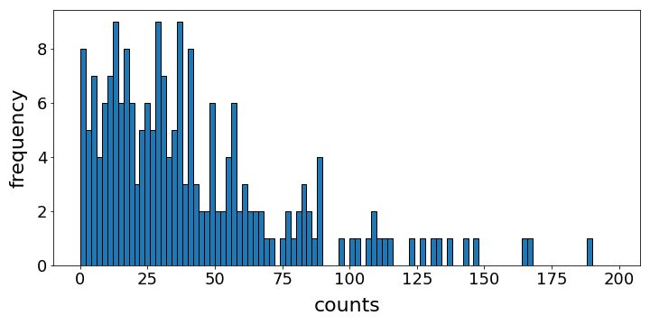
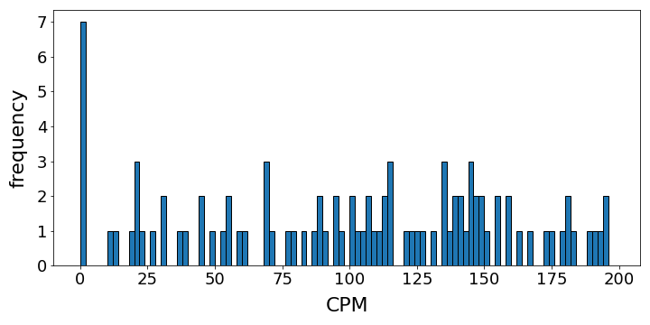
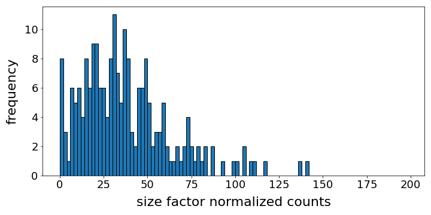
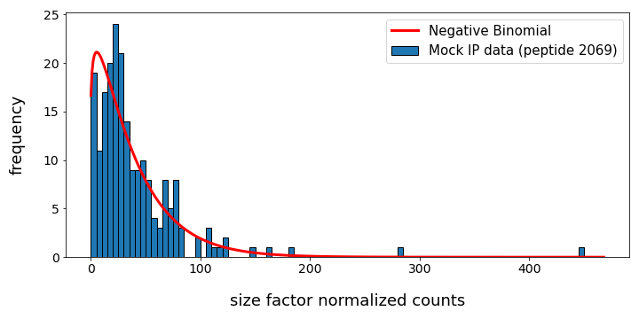
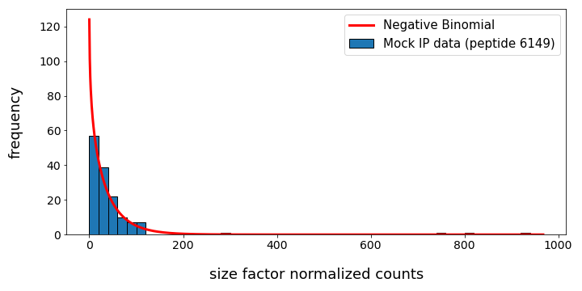
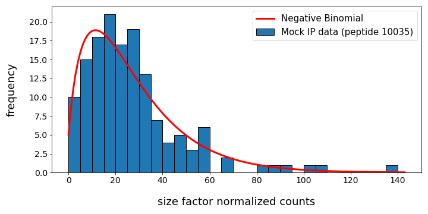

.. _sec_background_modeling:

===================
Background Modeling
===================

Introduction
------------

Ideally, the phages that are pulled down in the immunoprecipitate are bound to antibodies, but in practice some unbound phages are
also attracted by the magnetic beads. This introduces a background of peptide counts. To assess this background, PhIP-Seq runs are
performed without the presence of antibodies; these *mock-IP* samples are used to derive a background model for each peptide 
species in the library. Peptide counts from empirical samples can then be compared with the associated background model to compute 
a p-value -- how likely the observed count is a background interaction. Therefore, genuine enrichment from antibody-peptide binding 
should result in a small p-value. In ``phippery``, the negative binomial model is implemented as a fit per peptide species over 
mock-IP data.

Normalization via Size Factors
------------------------------

Before fitting to the mock-IP data, counts must be normalized to account for variations in total reads across samples.
It might be tempting to turn to the commonly used *counts per million* (CPM) normalization, but this is problematic if the
total reads of the samples are very different from one million. This is because read counts are discrete, not continuous,
and scaling the data arbitrarily can yield a distribution that cannot be simply described by a probability model. 
To choose a normalization factor that is more natural to the dataset, we employ the *size factor* quantity [#SizeFactors]_:

- A *pseudo-reference sample* is derived from computing the geomtric mean across all samples for each peptide
- For a specific sample to be normalized, consider for each peptide the ratio of the sample count to the pseudo-reference count; the median of these ratios is the normalization factor.

This method is designed to be less influenced by outlier counts from 
very highly enriched peptides. Both mock-IP and empirical samples should be considered together when
normalizing via size factors. In ``phippery``, the ``size_factor()`` function generates a new data table of size factor
normalized counts based on the samples in the input ``xarray.Dataset``.

As an example, consider the distribution of counts for a peptide across 207 mock-IP samples,

	
The average total reads in these mock-IP samples is about 200 000. Consequently, the CPM distribution contains many "gaps"
and is difficult to model. (The range of the histogram below is limited to 200 to show the problematic gaps, but the full
distribution extends much further.)

With size factor normalized counts, the distribution is more reasonable to model.

Negative Binomial Model
-----------------------

Peptide counts generally show over-dispersion with respect to the ideal Poisson distribution, and the negative binomial
distribution is a commonly used model to address this situation. A model is fit to the mock-IP data for each peptide species
and two parameters are returned, corresponding to the 
`SciPy <https://docs.scipy.org/doc/scipy/reference/generated/scipy.stats.nbinom.html>`_ 
parametrization of the negative binomial. Occasionally, a fit may fail to converge, usually due to little or no representation
in the mock-IP samples. The table below lists the possible outcomes of a fit.

.. list-table:: Return values for negative binomial fit
   :widths: 50 50
   :header-rows: 1

   * - Returns
     - Reason
   * - :math:`\mbox{size}\geq0, \mbox{prob}\geq0`
     - Fit converged normally
   * - :math:`\mbox{size}=\mbox{prob}=-1`
     - All counts are zero
   * - :math:`\mbox{size}=\mbox{prob}=-2`
     - Fit failed to converge

Below are some examples of fits to data.

References

.. [#SizeFactors] Anders, S. and Huber, W., `Differential expression analysis for sequence count data
                  <https://genomebiology.biomedcentral.com/articles/10.1186/gb-2010-11-10-r106>`_. Genome Biology, 2010. **11**:R106.