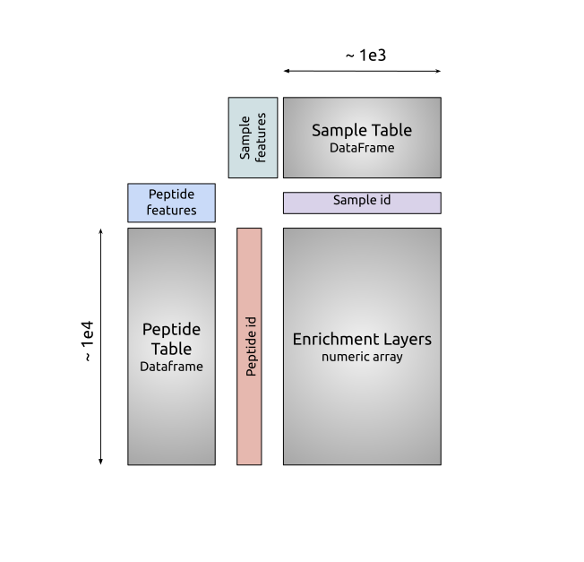

.. _sec_dev_intro:

===========
Development
===========

Developer Install
^^^^^^^^^^^^^^^^^

For activate development, and documentation, we recommend using the following
instructions inside of a virtual environment or equivalent.

::

  » git clone https://github.com/matsengrp/phippery.git
  » (cd phippery && pip install -e ".[dev]")

Next, run the tests to make sure everything is working properly.

::

  » (cd phippery && pytest -vv)

  
Code Structure
^^^^^^^^^^^^^^

TODO

Building Documentation
^^^^^^^^^^^^^^^^^^^^^^

To edit the documentation seen here,
simply edit the respective `.rst` file 
(following the git workflow described below) 
in the `docs/` subdirectory. Once edited, you can check 
the edits are rendered correctly by building the docs locally

.. code-block::

  » cd docs/
  » make clean && make html

Then open the index file build at `_build/html/index.html`
with a browser of choice to inspect changes.

Once the changes have been approved and merged into the main branch
the documentation will automatically build and deploy.

  
Contributing
^^^^^^^^^^^^

TODO

.. _sec_python_intro:

Under the Hood
^^^^^^^^^^^^^^

The primary data strucure resulting from PhIP-Seq experiments is an *enrichment matrix*, 
X, with i rows and j columns. 
Commonly, row index represents a peptide that is displayed on a phage,
and each column represents a sample that was mixed with the entire phage library. 
After sequencing and demultiplexing each sample, we align the reads to the 
oligonucleotide reference library to observe a
count of aligned reads to each peptide.

Outside of the enrichment matrix, each *sample* in an experiment as well as each *peptide*
in the phage library used have number of important annotations required when
performing analysis tasks like model fitting, normalizing, and differential selection.
Additionally, the comparison across groups of virus proteins and 
sample types is crucial in many experiments. For large sample size experiments, 
it can be difficult to cross reference each of these groups before and
after analysis. 

Here, we take advantage of the powerful 
`xarray <http://xarray.pydata.org/en/stable/index.html>`_
approach to organizing all the Phip-Seq data along four primary coordinate 
dimensions which tie all sample/peptide enrichments to the respective annotations. 
Doing this allows us to store all the information without the error prone 
step of cross-checking separate dataframes, and without the
large storage scaling of using "Tall" dataframes.

.. _sec_anno_intro:

Annotation Tables
^^^^^^^^^^^^^^^^^

.. _sec_pipeline_anno:

Informative annotations for the enrichment matrix rows (peptides), 
and columns (samples) are at the core of our approach to analysis of this
type of data. The high-throughput, brute-force nature of this protocol
results in what may be most understand as *many* small experiments 
- providing us with information about *binding profiles* for each 
of serum samples in a study. 
These binding profiles are comprised of tens, to hundreds-of-thousands
of measurements, each themselves representing a potential binding event to 
one of the peptides in the entire phage display library.
While there are really no
*required* annotations for this format,
but the tools described here are pretty 

Because this information is so useful for computing various transformations on the data,
and so useful for keeping large datasets organized and coherent,
we require the user provides these annotations tables in a strait-forward, 
albeit *specific* format. 
If you run the 
:ref:`alignment pipeline <sec_pipeline_intro>`
provided here, then this format is prepared and currently pickle 
dumped to a binary file, usually with a ".phip" extension.

  **Xarray Dataset Format** A cartoon representation
  of the format output by the pipeline for 
  we requre for using phippery functions.
  Concretely, for a matrix, `\mathcal{M}_{i}{j}` 

Missing Data
^^^^^^^^^^^^

When dealing with missing values in the annotation tables, we use the 
`pd.convert_dtypes <https://pandas.pydata.org/docs/reference/api/pandas.DataFrame.convert_dtypes.html>`_
function to best allow for missing annotations, while maintaining the integrity of
the inferred datatype. It is highly recommended you stay consistent with datatype for feature annotations,
i.e. try not to mix values like `1` (integer), `6.7` (float), and `hello_world` (string) in any one of the columns. 
For missing data of any type, 
The following values will be interpreted as `NaN`:

::

  ‘’, ‘#N/A’, ‘#N/A N/A’, 
  ‘#NA’, ‘-1.#IND’, ‘-1.#QNAN’, ‘-NaN’, ‘-nan’, ‘1.#IND’, ‘1.#QNAN’, ‘<NA>’, 
  ‘N/A’, ‘NA’, ‘NULL’, ‘NaN’, ‘n/a’, ‘nan’, ‘null’.
