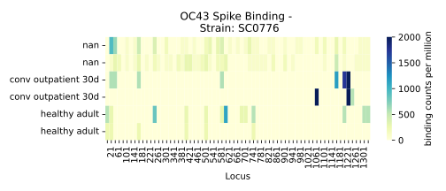

.. note:: The software presented here is still under construction and 
    considered to be in the "Beta" stage of production. 
    Please expect and excuse innevitable changes, 
    for questions and/or suggestions, please feel welcome 
    to contact jgallowa (at) fredhutch.org

.. _sec_quick_start:

========
Examples
========

There are a few primary steps to PhIP-Seq analysis after the sequencing and
demultiplexing of samples. To address each of these, we provide
A flexible `Nextflow automated pipeline <https://www.nextflow.io/>`_ 
used for producing the 
`raw enrichment data <TODO>`_ when provided 
Next Generations Sequencing (demultiplexed `fastq files <TODO>`_) data, 
as well as coupled `sample and peptide library annotation files <TODO>`_ 
files, as input.
Below, we'll give a brief overview of using the pipeline on some example data,
followed by a typical approach for running on some new data.

Pan-CoV example dataset
^^^^^^^^^^^^^^^^^^^^^^^

The dataset provided with this pipeline
is derived from a pre-COVID-19 heathy adult serum
sample, along with serum from a SARS-CoV-2 infected convalescent individual
both run in duplicate across two separate batches of Pan-Human CoV, full
proteome libraries. 
Huge thanks to the authors of
`Stoddard et al. 2021 <https://www.cell.com/cell-reports/fulltext/S2211-1247(21)00506-4?_returnURL=https%3A%2F%2Flinkinghub.elsevier.com%2Fretrieve%2Fpii%2FS2211124721005064%3Fshowall%3Dtrue>`_ and the wonderful folks at the
`Overbaugh Lab <TODO>`_ for running this data and allowing us to use it here.

.. _sec_align_soup_nutz:

The example data is included and run by default unless specified otherwise.
This input includes the next generation
sequencing files for each of the six samples described
in the `sample table <https://github.com/matsengrp/phip-flow-template/blob/main/Pan-CoV-example-ds/sample_table.csv>`_. We'll begin by aligning 
the fastq files to oligo library described by the 
Oligonucleotide encoding sequences in the 
`peptide table <https://github.com/matsengrp/phip-flow-template/blob/main/Pan-CoV-example-ds/peptide_table.csv>`_.

Running locally
+++++++++++++++

.. _sec_clone_template:

To run the pipeline locally we can use the 
`nextflow run <https://www.nextflow.io/docs/latest/sharing.html#running-a-pipeline>`_, 
git aware command to download all pipeline code, data, and dependencies at once.
Simply:
::

    nextflow run matsengrp/phip-flow --output_tall_csv true --output_wide_csv true -profile docker

.. warning::
    if you get the message: 
    ``Project `matsengrp/phip-flow` currently is sticked on revision:...``,
    Either run ``nextyflow drop matsengrp/phip-flow``, or
    specify a specific version of the pipeline using the ``-r`` parameter.
    See `this link <https://nf-co.re/usage/troubleshooting#warning-about-sticked-on-revision>`_ for more information about this error

Here we specified three parameters; one native to ``Nextflow`` 
(denoted with a single **'-'** prefix), and two which are specific to 
``phip-flow`` (double minus **'- -'** symbols, for these).
the options ``output_tall_csv`` and ``output_wide_csv`` this options specifies one
of three optional output formats; tall csv, wide csv, and a pickle'd
binary xarray Dataset object. For more on these formats see this 
`great blog post <https://medium.com/w2hds/wide-tall-data-formats-423331ab5991>`_ 
on the topic.

This command ran the pipeline on the example dataset 
described above, the files can be viewed in the
`phip-flow git repo <https://github.com/matsengrp/phip-flow/tree/41_bin/data/pan-cov-example>`_.
In short, the workflow (1) used ``bowtie`` 
to align all the reads described in the 
sample annotation table, to the reference phage library described in the 
peptide table, (2) computed some usefule stats, and (3) formatted the data
into a single coherent dataset.
For more detail about the exact steps that were run, 
see the :ref:`nextflow pipeline page <sec_pipeline_intro>`

Running on HPC (cluster)
++++++++++++++++++++++++

Above, we specified **-profile docker** parameter option,
which will assume you are running
this locally with **Docker** and **Nextflow** installed. 
for high performance computing systems, we can also specify
the **-profile cluster** option for running the default configurations
on a `slurm <https://slurm.schedmd.com/documentation.html>`_ cluster.
This option assumes the cluster has loaded modules or installs for 
*Singularity* and *Nextflow*. Here's an example script we might execute to run
the pipeline on the Fred Hutch Rhino machines:

.. code-block:: bash

    #!/bin/bash

    set -e
    source /app/lmod/lmod/init/profile

    module load nextflow
    module load Singularity
    export PATH=$SINGULARITYROOT/bin/:$PATH

    nextflow run matsengrp/phip-flow \
            --output_tall_csv true \
            --output_wide_csv true \
            --results "$(date -I)" \
            -profile cluster \
            -resume

Example results (tall csv)
++++++++++++++++++++++++++

Now, let's lets take a quick 
look at the results from the Pan-CoV example dataset that was run.
By default, the pipeline runs the Pan-CoV example data,
and writes the results out to a directory, "*results/*".
The pickled binary `xarray <https://xarray-contrib.github.io/xarray-tutorial/scipy-tutorial/01_datastructures_and_io.html>`_ object is output by default
as it is the primary data structure for using the 
:ref:`Python CLI <sec_cli_intro>`. Additionally,
we specified that a tall style data ("data-tall.csv"), as well
as a collection of wide style data matrices be output.
Let's take a quick look.

::

  results
  ├── pickle_data
  │   └── data.phip
  ├── tall_data
  │   └── data-tall.csv
  └── wide_data
      ├── data_counts.csv
      ├── data_cpm.csv
      ├── data_enrichment.csv
      ├── data_peptide_annotation_table.csv
      ├── data_sample_annotation_table.csv
      └── data_size_factors.csv
  
  3 directories, 8 files
  
Let's take a look at how you might use **ggplot**
to visualize the data found in the tall formatted csv.
We'll start by plotting the individual sample enrichments, colored by
infection status.

.. code-block:: R

  library(ggplot2)
  library(dplyr)
  library(viridis)
  
  phip_data <- read.table(
          "results/tall_data/data-tall.csv", 
          header=TRUE, sep= ","
      ) %>%
      filter(Protein == "spike") %>%
      filter(Virus == "SARSCoV2") 
  
  # Plot
  p <- phip_data %>%
    ggplot(aes(
          x=Prot_Start, y=counts, 
          group=factor(sample_id), 
          color=factor(patient_status))
      ) +
      theme_bw() +
      geom_line() +
      ggtitle("Sars-CoV-2 Spike Protein Enrichments") +
      labs(y="# peptide alignments", x="Locus", color="infection status")

.. figure:: images/example_counts.svg
  :width: 700
  :alt: example results
  :align: left

  Example data counts plotted as a function of location on the Spike
  protein of the Sars-CoV-2 Virus, and colored by infection status of the
  sample. NA is a pure library input sample - meaning no IP was performed.

Example results (wide csv)
++++++++++++++++++++++++++

Looking at the files in the wide format sub directory, we are given back the
peptide and sample annotation table's, both 
with an index (i.e. first) column "peptide_id" and "sample_id".
These indexes can simply be mapped back to the rows and columns
of each of the output enrichment matrices.
By default, the phip-flow pipeline outputs the raw counts, as well as
counts per million, and size factors (anders and huber, 2014 <TODO cite>)
normalizations of the matrix.
Let's use matplotlib's implot to plot the same samples as a heatmap.

.. code-block:: python3

  import pandas as pd 
  import seaborn as sns
  import matplotlib.pyplot as plt
  
  cpm = pd.read_csv("results/wide_data/data_cpm.csv", index_col=0, header=0)
  sample_table = pd.read_csv("results/wide_data/data_sample_annotation_table.csv")
  peptide_table = pd.read_csv("results/wide_data/data_peptide_annotation_table.csv")
  OC43_spike = peptide_table.query("Full_name == 'OC43_SC0776_spike'")
  
  cpm_OC43_spike = cpm.loc[OC43_spike.index, :]
  
  fig, ax = plt.subplots(figsize=[7, 3])
  sns.heatmap(
          cpm_OC43_spike.transpose(), 
          yticklabels=sample_table["patient_status"], 
          xticklabels=OC43_spike["Prot_Start"], 
          cbar_kws={'label': 'binding counts per million'},
          ax=ax, cmap="YlGnBu"
      )
  
  for label in ax.xaxis.get_ticklabels()[::2]:
      label.set_visible(False)
  
  ax.set_title("OC43 Spike Binding - \n Strain: SC0776")
  ax.set_xlabel("Locus")
  plt.tight_layout()

  A heatmap of peptide alignment counts per million across the OC43
  Spike protein.

.. _example_own_data:

Creating and Running your own data
^^^^^^^^^^^^^^^^^^^^^^^^^^^^^^^^^^

Input to the pipeline is dependent upon the following.

- **NGS files**:demultiplexed fastq files for each of the samples.

- **sample annotation table**: a csv containing a column *fastq_filepath*,
  where each row contains a path relative from where the pipeline is run
  to where the respective fastq file resides.

- **peptide annotation table**: a csv containing a column *oligo*,
  where each row contains a single peptide from the complete library
  used in the IP step. This will be generated into and index for all sample
  to be aligned to.

As an example let's assume there's some directory *ngs/* containing all the
fastq files for a project. To organize these files (excluding barcode files) 
into a minimal sample table descirbing each of their relative paths, we might 
use the following command.

.. code-block:: bash
  
    (echo "fastq_filepath" && ls ngs/*R1*.gz)  > sample_table.csv

Now, we must have a peptides file which will describe the phage library
being used in this particular study. Usually, we expect something of this
nature has been created prior to synthesizing the library during the
phage library design. For the sake of this pipeline, we must have 
a column denoting the oligonucleotide sequence. Here's an peek 
at what a `phage-dms <>`_ peptide annotation might look like:
::

  Virus,Protein,Loc,aa_sub,Loc_Rel,is_wt,oligo
  BG505,gp120,1,G,30,FALSE,aggaattctacgctgagtGGAGGAGGTGGTTCTGGTGGTGGAGGTTCAGGTGGTGGTGGAAGTGGTGAGAACCTGTGGGTGACCGTGTATTACGGCGTTCCTGTCTGGAAAtgatagcaagcttgcc
  BG505,gp120,1,E,30,FALSE,aggaattctacgctgagtGGAGGAGGTGGTTCTGGTGGTGGAGGTTCAGGTGGTGGTGGAAGTGAAGAGAACCTGTGGGTGACCGTGTATTACGGCGTTCCTGTCTGGAAAtgatagcaagcttgcc
  BG505,gp120,1,D,30,FALSE,aggaattctacgctgagtGGAGGAGGTGGTTCTGGTGGTGGAGGTTCAGGTGGTGGTGGAAGTGACGAGAACCTGTGGGTGACCGTGTATTACGGCGTTCCTGTCTGGAAAtgatagcaagcttgcc
  BG505,gp120,1,V,30,FALSE,aggaattctacgctgagtGGAGGAGGTGGTTCTGGTGGTGGAGGTTCAGGTGGTGGTGGAAGTGTTGAGAACCTGTGGGTGACCGTGTATTACGGCGTTCCTGTCTGGAAAtgatagcaagcttgcc
  BG505,gp120,1,A,30,TRUE,aggaattctacgctgagtGGAGGAGGTGGTTCTGGTGGTGGAGGTTCAGGTGGTGGTGGAAGTGCTGAGAACCTGTGGGTGACCGTGTATTACGGCGTTCCTGTCTGGAAAtgatagcaagcttgcc
  BG505,gp120,1,R,30,FALSE,aggaattctacgctgagtGGAGGAGGTGGTTCTGGTGGTGGAGGTTCAGGTGGTGGTGGAAGTCGTGAGAACCTGTGGGTGACCGTGTATTACGGCGTTCCTGTCTGGAAAtgatagcaagcttgcc
  BG505,gp120,1,S,30,FALSE,aggaattctacgctgagtGGAGGAGGTGGTTCTGGTGGTGGAGGTTCAGGTGGTGGTGGAAGTTCTGAGAACCTGTGGGTGACCGTGTATTACGGCGTTCCTGTCTGGAAAtgatagcaagcttgcc
  BG505,gp120,1,K,30,FALSE,aggaattctacgctgagtGGAGGAGGTGGTTCTGGTGGTGGAGGTTCAGGTGGTGGTGGAAGTAAAGAGAACCTGTGGGTGACCGTGTATTACGGCGTTCCTGTCTGGAAAtgatagcaagcttgcc
  BG505,gp120,1,N,30,FALSE,aggaattctacgctgagtGGAGGAGGTGGTTCTGGTGGTGGAGGTTCAGGTGGTGGTGGAAGTAACGAGAACCTGTGGGTGACCGTGTATTACGGCGTTCCTGTCTGGAAAtgatagcaagcttgcc

.. warning:: Currently, only *upper case* oligonucleotides will be included as
    part of the reference index when aligning the reads. Historically, we have
    encoded the barcodes with lower case letters.

With these, we can simply use the same command as shown above, however, now
we will specify the ``--sample_table``, and ``--peptide_table`` parameters
to the ``run`` command:

.. code-block:: bash

    #!/bin/bash

    set -e
    source /app/lmod/lmod/init/profile

    module load nextflow
    module load Singularity
    export PATH=$SINGULARITYROOT/bin/:$PATH

    nextflow run matsengrp/phip-flow \
            --sample_table sample_table.csv \
            --peptide_table peptide_table.csv \
            --output_tall_csv true \
            --output_wide_csv true \
            --results "$(date -I)" \
            -profile cluster \
            -resume

Note that while here we specified nothing but the fastq filepaths
in the sample table, we could have specified populated the csv with
any number of useful annotations pertaining the the fastq files in each
of the rows. Any of the annotations added here, will be tied in correctly
to all output formats for more organized downstream analysis and plotting.

If you want to run some of the more advanced analysis available through
this pipeline such as fold enrichment, 
differential selection, or model fitting for
you will need to include special annotations
in either of the annotation tables. 
The respecitve columns requirements and
descriptions can be found in the 
:ref:`optional workflows <sec_optional_workflows>` section of the documentation.

