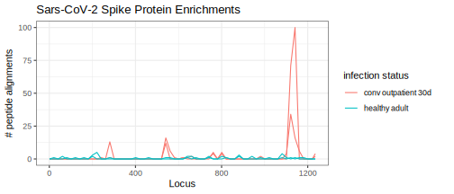
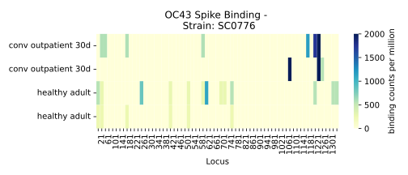

.. _sec_quick_start:

========
Examples
========

There are a few primary steps to PhIP-Seq analysis after the sequencing and
demultiplexing of samples. To address each of these, we provide
a flexible `Nextflow automated pipeline <https://www.nextflow.io/>`_ 
used for producing the 
enrichment data when provided 
Next Generation Sequencing (demultiplexed fastq files) data, 
as well as coupled sample and peptide library annotation files, as input.
Below, we'll give a brief overview of using the pipeline on some example data,
followed by a typical approach for running on some new data.

Pan-CoV example dataset
^^^^^^^^^^^^^^^^^^^^^^^

The dataset provided with this pipeline
is derived from a pre-COVID-19 healthy adult serum
sample, along with serum from a SARS-CoV-2 infected convalescent individual,
both run in duplicate across two separate batches of the Pan-Human CoV full
proteome library. 
Huge thanks to the authors of
`Stoddard et al. 2021 <https://www.cell.com/cell-reports/fulltext/S2211-1247(21)00506-4?_returnURL=https%3A%2F%2Flinkinghub.elsevier.com%2Fretrieve%2Fpii%2FS2211124721005064%3Fshowall%3Dtrue>`_ and the wonderful folks at the
`Overbaugh Lab <https://research.fredhutch.org/overbaugh/en.html?gad=1&gclid=CjwKCAjwt52mBhB5EiwA05YKo-uynL2L5bWJsRIpJxNoJNbyNdSkwZ-ByrSBTadfWK0iAvDSLILaFxoCFGkQAvD_BwE>`_ for obtaining this data and allowing us to use it here.

.. _sec_align_soup_nutz:

The example data is included and run by default unless specified otherwise.
This input includes the next generation
sequencing files for each of the six samples described
in the `sample table <https://github.com/matsengrp/phip-flow/blob/main/data/pan-cov-example/sample_table.csv>`_: 
the replicates of the samples described above, as well as two replicates of the input phage library. 
We'll begin by aligning the fastq files to the oligo library described by the 
oligonucleotide coding sequences in the 
`peptide table <https://github.com/matsengrp/phip-flow/blob/main/data/pan-cov-example/peptide_table.csv>`_.

Running locally
+++++++++++++++

.. _sec_clone_template:

To run the following example, you must first have installed
`docker <https://www.docker.com/products/docker-desktop/>`_,
and `Nextflow <https://www.nextflow.io/docs/latest/getstarted.html>`_.
For our approach to easy installation, see the :ref:`installation page <sec_installation_phipflow>`.

To run the pipeline, we can use the 
`nextflow run <https://www.nextflow.io/docs/latest/sharing.html#running-a-pipeline>`_, 
git-aware command. This will run the specified version (``-r V1.12``) of the pipeline in the current working directory.
We recommend using the latest version which can be seen in the `release section <https://github.com/matsengrp/phip-flow/releases>`_ of the repository.
Note that no cloning of the repository is necessary if we're simply running the pipeline and
we do not wish to modify the source code.

Simply:
::

    $ nextflow run matsengrp/phip-flow -r V1.12 -profile docker --output_tall_csv true

Here we specified three parameters: two that are native to ``Nextflow`` 
(denoted with a single **'-'** prefix) and one that is specific to 
``PhIP-Flow`` (double minus **'- -'** symbols).
Here, we did not specify a sample table or peptide table, so the pipeline
will run on the default example data.
Additionally, we did not specify a results directory, so the pipeline will
,by default, write to ``results/``:
(1) a pickled binary 
`xarray DataSet object <https://xarray-contrib.github.io/xarray-tutorial/scipy-tutorial/01_datastructures_and_io.html>`_
(as it is the primary data structure for using the :ref:`Python CLI <sec_cli_intro>`)
in addition to 
(2) an RDS file for the respective `PhIPData Object <https://github.com/athchen/PhIPData/>`_.
The options ``--output_tall_csv`` (default false) and ``--output_wide_csv`` (default true) each specifies one
of two optional output formats: a tall CSV and a collection of wide CSVs. 

.. seealso:: For more on the parameters that specify pipeline behavior, see the
    :ref:`alignments pipeline parameters <sec_pipeline_params>` section.

.. note:: For more on these CSV formats see this 
    `great blog post <https://medium.com/w2hds/wide-tall-data-formats-423331ab5991>`_ 
    on the topic.

By default, this command ran the pipeline on the example dataset 
described above. The files can be viewed in the
`phip-flow git repo <https://github.com/matsengrp/phip-flow/tree/41_bin/data/pan-cov-example>`_.
In short, the workflow 
(1) used ``bowtie`` to align all the reads described in the 
sample annotation table to the reference phage library described in the 
peptide table, 
(2) computed some useful statistics on raw counts 
(such as the edgeR log fold enrichment), and
(3) formatted the data
into a single coherent dataset.
For more detail about the exact steps that were run, 
see the :ref:`nextflow pipeline page <sec_pipeline_intro>`.

Running on HPC (cluster)
++++++++++++++++++++++++

Above, we specified ``-profile docker`` as a parameter option,
which will assume you are running
this locally with ``Docker`` and ``Nextflow`` installed. 
For high performance computing systems, we can also specify
the ``-profile cluster`` option for running the default configurations
on a `slurm <https://slurm.schedmd.com/documentation.html>`_ cluster.
This option assumes the cluster has loaded modules or installs for 
Singularity and Nextflow. Here's an example script we might execute to run
the pipeline on the Fred Hutch Rhino machines:

.. code-block:: bash

    #!/bin/bash

    set -e
    source /app/lmod/lmod/init/profile

    module load nextflow
    module load Singularity
    export PATH=$SINGULARITYROOT/bin/:$PATH

    nextflow run matsengrp/phip-flow -r V1.12 \
            --read_length 125 \
            --oligo_tile_length 117 \
            --output_tall_csv true \
            --results "$(date -I)" \
            -profile cluster \
            -resume

Here, we specified a few more parameters, ``--read_length`` and ``--oligo_tile_length`` that define our input data for alignment purposes.
See the :ref:`Creating and running your own data <example_own_data>` section for more details on these.

Example results (tall CSV)
++++++++++++++++++++++++++

Now, let's take a quick 
look at the results from the Pan-CoV example dataset that was run.
By default, the pipeline runs the Pan-CoV example data,
and writes the results out to a directory, "*results/*".
The pickled binary 
`xarray <https://xarray-contrib.github.io/xarray-tutorial/scipy-tutorial/01_datastructures_and_io.html>`_ 
object is output by default, and we additionally specified that a tall style data ("data-tall.csv") as well
as a collection of wide style data matrices be output.
Let's take a quick look.

::

  results
  ├── pickle_data
  │   └── data.phip
  ├── rds_data
  │   └── PhIPData.rds
  ├── tall_data
  │   └── data-tall.csv.gz
  └── wide_data
      ├── data_counts.csv.gz
      ├── data_cpm.csv.gz
      ├── data_edgeR_hits.csv.gz
      ├── data_edgeR_logfc.csv.gz
      ├── data_edgeR_logpval.csv.gz
      ├── data_peptide_annotation_table.csv.gz
      ├── data_sample_annotation_table.csv.gz
      └── data_size_factors.csv.gz

  4 directories, 11 files

Note the csv outputs are ``gzipped``, so we'll need to unzip them before
moving forward. The following command unzip's all the csv files in the
results directory.

::

  gunzip results/**/*.csv.gz

Let's take a look at how you might use **ggplot**
to visualize the data found in the tall formatted CSV.
We'll start by plotting the individual sample enrichments, colored by
infection status.

.. code-block:: R

    library(ggplot2)
    library(dplyr)
    library(viridis)

    phip_data <- read.table(
          "results/tall_data/data-tall.csv", # gunzip first
          header=TRUE, sep= ","
      ) %>%
      filter(Protein == "spike") %>%
      filter(Virus == "SARSCoV2") 

    # Plot
    p <- phip_data %>%
    ggplot(aes(
          x=Prot_Start, y=counts, 
          group=factor(sample_id), 
          color=factor(patient_status))
      ) +
      theme_bw() +
      geom_line() +
      ggtitle("Sars-CoV-2 Spike Protein Enrichments") +
      labs(y="# peptide alignments", x="Locus", color="infection status")

  Example data counts plotted as a function of location on Spike
  protein of SARS-CoV-2, and colored by infection status of the
  sample.

Example results (wide CSV)
++++++++++++++++++++++++++

Looking at the files in the wide format sub directory, we are given back the
peptide and sample annotation tables, both 
with an index (i.e. first) column "peptide_id" and "sample_id".
These indices can simply be mapped back to the rows and columns
of each of the output enrichment matrices.
By default, the phip-flow pipeline outputs the raw counts as well as
counts per million and size factor normalizations
(`Anders and Huber, 2010 <https://genomebiology.biomedcentral.com/articles/10.1186/gb-2010-11-10-r106>`_)
of the matrix.
Let's use matplotlib's ``implot`` to plot the same sample's binding to OC43 as a heatmap.

.. code-block:: python3

    import pandas as pd
    import seaborn as sns
    import matplotlib.pyplot as plt

    cpm = pd.read_csv("results/wide_data/data_cpm.csv", index_col=0, header=0)
    cpm.columns = cpm.columns.astype(int)
    sample_table = pd.read_csv("results/wide_data/data_sample_annotation_table.csv")
    peptide_table = pd.read_csv("results/wide_data/data_peptide_annotation_table.csv")

    OC43_spike = peptide_table.query("Full_name == 'OC43_SC0776_spike'")
    non_null_samples = sample_table.query("patient_status.notnull()")
    cpm_OC43_spike = cpm.loc[OC43_spike.index, non_null_samples.index]

    fig, ax = plt.subplots(figsize=[7, 3])
    sns.heatmap(
          cpm_OC43_spike.transpose(),
          yticklabels=non_null_samples["patient_status"],
          xticklabels=OC43_spike["Prot_Start"],
          cbar_kws={'label': 'binding counts per million'},
          ax=ax, cmap="YlGnBu",
          vmax = 2000
      )

    for label in ax.xaxis.get_ticklabels()[::2]:
      label.set_visible(False)

    ax.set_title("OC43 Spike Binding - \n Strain: SC0776")
    ax.set_xlabel("Locus")
    plt.tight_layout()

  A heatmap of peptide alignment counts per million across the OC43
  Spike protein. Each row corresponds to a sample replicate.

.. _example_own_data:

Creating and running your own data
^^^^^^^^^^^^^^^^^^^^^^^^^^^^^^^^^^

.. _alignment_approach:

Alignment approach
++++++++++++++++++

We designed this pipeline to work well with the common protocol for PhIP-Seq
experiments; which is to use a single read, shotgun sequencing of the phage library
after the antibody immunoprecipitation step.
We expect the input reads to be trimmed to a uniform length 
(specified with the ``--read_length`` parameter), which should be
longer than, or equal to, the oligonucleotide sequence encoding any given peptide in the provided library
(specified with the ``--oligo_tile_length`` parameter).
Additionally, we assume that your peptide library is comprised of
uniform-length oligonucleotide sequences (tiles), and that sequencing adapters are 
designed such that the 5' (high-quality) end of the read is 
where alignment should begin.

Concretely, we perform alignment of reads to the peptide-encoding oligo sequences 
via `bowtie (-n mode) <https://bowtie-bio.sourceforge.net/manual.shtml#the--n-alignment-mode>`_.
This means alignments may have no more than ``--n_mismatches`` mismatches 
(where ``--n_mismatches`` is a number 0-3, with a default of 2) 
in the first ``--oligo_tile_length`` bases 
(where ``--oligo_tile_length`` is a number 5 or greater, with a default of 117) 
on the high-quality (left) end of the read.
Additional parameters for alignment can be specified by the ``--bowtie_optional_args`` parameter,
which by default is ``--tryhard --nomaqround --norc --best --sam --quiet``.
This specifies that the aligner should not be looking at the reverse compliment
of the oligo sequences, and that it should report *only* the best alignment for each read.
This can be modified as you see fit.
It's worth noting that while we only report a single alignment per read,
if there are identical oligo sequences in the peptide table (described below)
then the parameter ``--replicate_sequence_counts`` (default True) will ensure that
that the resulting alignment counts for all replicate sequences are reported as the sum 
of alignments across each.

Ideally, the ``--read_length`` is the same as the length specified by the 
``--oligo_tile_length`` parameter.
If the ``read_length`` is greater than the ``oligo_tile_length``,
we use bowtie's ``--trim3`` parameter to trim the reads on the 3' 
end to match the ``--oligo_tile_length``.
If for some reason reads are shorter than the ``--oligo_tile_length``,
or variable in length, then we recommend setting the ``--read_length`` to ``0``,
and potentially allowing for more ``--n_mismatches`` 
such that reads are *not* trimmed before alignment, and partial reads still have a chance
at being reported. 

If you would like to modify the behavior of the alignment approach
outside the scope of the ``--bowtie_optional_args`` parameters described above
or even the alignment tool itself,
and you have experience with Nextflow, 
it should be relatively straightforward to modify the
`alignment template script <https://github.com/matsengrp/phip-flow/blob/main/templates/short_read_alignment.sh>`_, it's 
`respective parameters <https://github.com/matsengrp/phip-flow/blob/0a36357f4369bdd3919e33f8a6458c2577693f96/nextflow.config#L40>`_, 
and the 
`associated process definition <https://github.com/matsengrp/phip-flow/blob/main/workflows/alignment.nf>`_.

Input file requirements
+++++++++++++++++++++++

Input to the pipeline is dependent upon the following:

- **NGS files**: Single-read, demultiplexed fastq files for each of the samples.
  We do not currently support paired-end reads. 

- **sample annotation table**: a CSV containing a column *fastq_filepath*,
  where each row contains a path relative from where the pipeline is run
  to where the respective fastq file resides.

- **peptide annotation table**: a CSV containing a column *oligo*,
  where each row contains a single peptide from the complete library
  used in the antibody immunoprecipitation step. This will be generated into an index for all samples
  to be aligned to.

As an example, let's assume there's some directory *ngs/* containing all the
fastq files for a project. To organize these files (excluding barcode files) 
into a minimal sample table describing each of their relative paths, we might 
use the following command.

.. code-block:: bash
  
    (echo "fastq_filepath" && ls ngs/*R1*.gz)  > sample_table.csv

Now, we must have a peptide annotation file which will describe the phage library
being used in this particular study. Usually, we expect something of this
nature has been created prior to synthesizing the library during the
phage library design. For the sake of this pipeline, we must have 
a column denoting the oligonucleotide sequence. Here's an peek 
at what a 
`phage-dms <https://www.sciencedirect.com/science/article/pii/S2589004220308142>`_ 
peptide annotation might look like: 
::

  Virus,Protein,Loc,aa_sub,Loc_Rel,is_wt,oligo
  BG505,gp120,1,G,30,FALSE,aggaattctacgctgagtGGAGGAGGTGGTTCTGGTGGTGGAGGTTCAGGTGGTGGTGGAAGTGGTGAGAACCTGTGGGTGACCGTGTATTACGGCGTTCCTGTCTGGAAAtgatagcaagcttgcc
  BG505,gp120,1,E,30,FALSE,aggaattctacgctgagtGGAGGAGGTGGTTCTGGTGGTGGAGGTTCAGGTGGTGGTGGAAGTGAAGAGAACCTGTGGGTGACCGTGTATTACGGCGTTCCTGTCTGGAAAtgatagcaagcttgcc
  BG505,gp120,1,D,30,FALSE,aggaattctacgctgagtGGAGGAGGTGGTTCTGGTGGTGGAGGTTCAGGTGGTGGTGGAAGTGACGAGAACCTGTGGGTGACCGTGTATTACGGCGTTCCTGTCTGGAAAtgatagcaagcttgcc
  BG505,gp120,1,V,30,FALSE,aggaattctacgctgagtGGAGGAGGTGGTTCTGGTGGTGGAGGTTCAGGTGGTGGTGGAAGTGTTGAGAACCTGTGGGTGACCGTGTATTACGGCGTTCCTGTCTGGAAAtgatagcaagcttgcc
  BG505,gp120,1,A,30,TRUE,aggaattctacgctgagtGGAGGAGGTGGTTCTGGTGGTGGAGGTTCAGGTGGTGGTGGAAGTGCTGAGAACCTGTGGGTGACCGTGTATTACGGCGTTCCTGTCTGGAAAtgatagcaagcttgcc
  BG505,gp120,1,R,30,FALSE,aggaattctacgctgagtGGAGGAGGTGGTTCTGGTGGTGGAGGTTCAGGTGGTGGTGGAAGTCGTGAGAACCTGTGGGTGACCGTGTATTACGGCGTTCCTGTCTGGAAAtgatagcaagcttgcc
  BG505,gp120,1,S,30,FALSE,aggaattctacgctgagtGGAGGAGGTGGTTCTGGTGGTGGAGGTTCAGGTGGTGGTGGAAGTTCTGAGAACCTGTGGGTGACCGTGTATTACGGCGTTCCTGTCTGGAAAtgatagcaagcttgcc
  BG505,gp120,1,K,30,FALSE,aggaattctacgctgagtGGAGGAGGTGGTTCTGGTGGTGGAGGTTCAGGTGGTGGTGGAAGTAAAGAGAACCTGTGGGTGACCGTGTATTACGGCGTTCCTGTCTGGAAAtgatagcaagcttgcc
  BG505,gp120,1,N,30,FALSE,aggaattctacgctgagtGGAGGAGGTGGTTCTGGTGGTGGAGGTTCAGGTGGTGGTGGAAGTAACGAGAACCTGTGGGTGACCGTGTATTACGGCGTTCCTGTCTGGAAAtgatagcaagcttgcc

.. warning:: Currently, only *upper case* oligonucleotides will be included as
    part of the reference index when aligning the reads. Historically, we have
    encoded the barcodes with lower case letters.

With these, we can simply use the same command as shown above, however, now
we will specify the ``--sample_table`` and ``--peptide_table`` parameters
to the ``run`` command:

.. code-block:: bash

    #!/bin/bash

    set -e
    source /app/lmod/lmod/init/profile

    module load nextflow
    module load Singularity
    export PATH=$SINGULARITYROOT/bin/:$PATH

    nextflow run matsengrp/phip-flow -r main \
            --sample_table sample_table.csv \
            --peptide_table peptide_table.csv \
            --output_tall_csv true \
            --output_wide_csv true \
            --results "$(date -I)" \
            -profile cluster \
            -resume

Note that while here we specified nothing but the fastq filepaths
in the sample table, we could have populated the CSV with
any number of useful annotations pertaining to the fastq files in each
of the rows. Any of the annotations added here will be tied in correctly
to all output formats for more organized downstream analysis and plotting.

If you want to run some of the more advanced analysis available through
this pipeline such as fold enrichment, 
differential selection, or model fitting for estimates of significance,
you will need to include special annotations
in either of the annotation tables. 
The requirements and descriptions of
these columns can be found in the 
:ref:`optional workflows <sec_optional_workflows>` section of the documentation.

