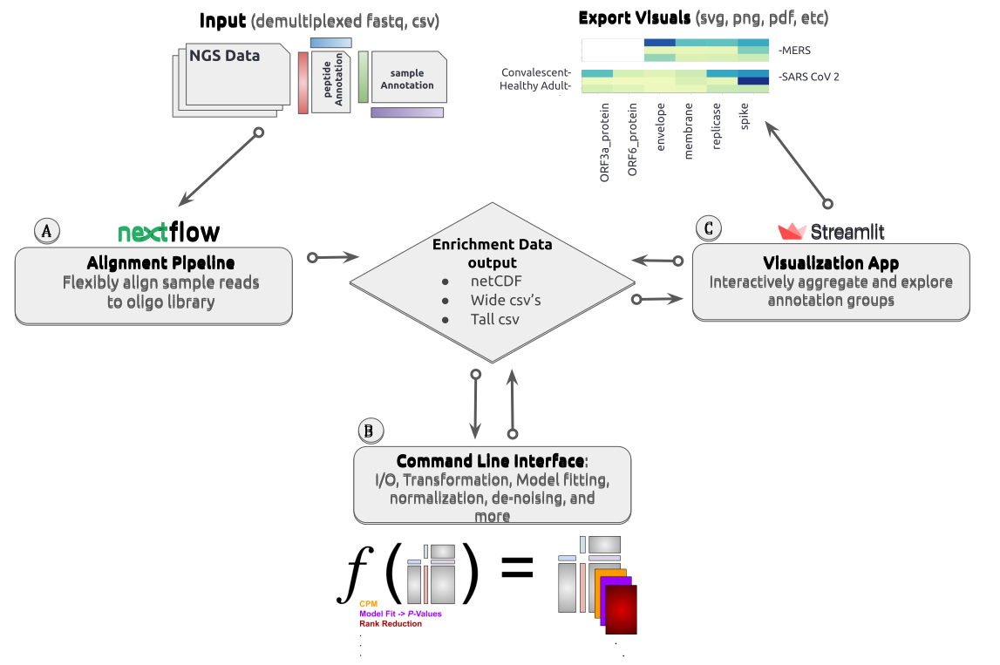

.. note:: The software presented here is still under construction and 
    considered to be in the "Beta" stage of production. 
    Please expect and check back for innevitable changes, 
    for questions and/or suggestions, please feel welcome 
    to contact jgallowa (at) fredhutch.org

.. _sec_introduction:

============
Introduction
============

Welcome to the documentation for ``phippery``. 
We present a software suite of data analysis tools for 
`Phage Immuno-Precipitation (PhIP-Seq) <https://www.nature.com/articles/s41596-018-0025-6>`_ [#PhIPSeq]_,
a high-throughput phage-display sequencing technique.
The software is designed for flexibility and general purpose, suitable for
either *commonly used* or *highly customized* phage-display libraries.

===============================================

  **Software tools schematic:** A cartoon flow 
  chart description of the workflow using
  each of the tools of ``phippery``.
  (A) Inputs from the experimentalist feeds into
  the alignment pipeline. The inputs are: the list 
  of demultiplexed files (fastq) for the samples
  under study, along with an annotation table of
  relevant sample-specific information; a peptide
  table listing all peptides in the phage library
  and includes features of interest (virus, protein,
  locus, etc); and importantly, the reference
  oligo sequences for the pipeline to align
  sequencing reads to.
  (B) A set of command line interface (CLI) tools
  to perform tasks such as data wrangling or
  model fitting. Most operations result in "layering"
  specific transformations onto the primary data
  structure. For more details on code structure and the 
  available CLI, see :ref:`under the hood <sec_python_intro>`.
  (C) An interactive browser-based application presents
  the layered data, allowing users to aggregate
  and visualize data by selecting on sample and peptide
  annotation features. The export functionality provides
  image files (of the visualization) or the
  underlying raw data (in tall or wide formats) for
  plotting with any of your favorite packages.

===============================================

+++++++++++++++
Getting Started
+++++++++++++++

- Head over to the :ref:`Installation <sec_install_intro>` 
  page to get installation instructions for each of the three tools described above.

- To get a feel for running each of the three related tools pictured above, 
  we suggest following a :ref:`walk through <sec_quick_start>` of running the
  alignments, CLI, and visualization app on some empirical data from `Stoddard et al. 2021 
  <https://doi.org/10.1016/j.celrep.2021.109164>`_ [#Stoddard]_. 

- Take a look at the :ref:`CLI commands <sec_cli_intro>` offered by the ``phippery``
  to perform your own analysis steps. 
  
- For creating your own dataset annotations, configuration, and NGS file structure,
  first review the :ref:`Annotations <sec_pipeline_anno>` section as many of the
  tools here require these tables as input for analyzing your own data.

++++++++++
Background
++++++++++

The advent of modern oligonucleotide synthesis allows researchers to generate
*highly* multiplexed assays such as PhIP-Seq, which is used to investigate
antibody-antigen interactions with comprehensive phage-display libraries.
The library used in VirScan [#VirScan]_, a general purpose application of PhIP-Seq, 
comprises of :math:`\mathcal{O}(10^5)` peptides spanning over 1000 individual
strains across 206 species of virus. There are also specialized library designs,
such as in deep mutational scanning for estimating the impact that mutations to
a viral protein may have on antibody binding [#PhageDMS]_.

Despite the growing use of the protocol, there is not yet an established set of
software tools for bioinformatics and computational tasks with PhIP-Seq data.
Much of the published code is specific to the authors' experiment, thus new researchers
are either piecing together snippets from others or developing scripts from scratch.
A goal of ``phippery`` is to provide some *efficient* and *unit-tested* general infrastructure
for computing enrichment, data formatting/storing/transforming, and other common analysis
functions. Each of the tools presented here can be used separately or in
conjuction for the rapid exploration of PhIP-Seq data.

++++++++++
References
++++++++++

.. [#PhIPSeq] Mohan, D., et al.,
              `PhIP-Seq characterization of serum antibodies using oligonucleotide-encoded peptidomes
              <https://doi.org/10.1038/s41596-018-0025-6>`_. Nat Protoc, 2018. **13** : p. 1958–1978 (2018).

.. [#Stoddard] Stoddard, C.I., et al., `Epitope profiling reveals binding signatures of 
               SARS-CoV-2 immune response in natural infection and cross-reactivity with endemic
               human CoVs <https://doi.org/10.1016/j.celrep.2021.109164>`_. Cell Reports, 2021.
               **35** (8): 109164.

.. [#VirScan] Xu, G.J., et al., `Comprehensive serological profiling of human populations using a
              synthetic human virome <https://dx.doi.org/10.1126%2Fscience.aaa0698>`_.
              Science, 2015. **348** (6239): aaa0698.

.. [#PhageDMS] Garrett, M.E., et al., `Phage-DMS: A Comprehensive Method for Fine Mapping of Antibody
               Epitopes <https://doi.org/10.1016/j.isci.2020.101622>`_. iScience, 2020. **23** (10): p. 101622.

+++++++++++++++++++++++++++++
Licensing and Acknowledgement
+++++++++++++++++++++++++++++

This work is provided by members of the 
`Matsen <https://matsen.fredhutch.org/>`_ and 
`Overbaugh <https://research.fredhutch.org/overbaugh/en.html>`_ groups at the
`Fred Hutchinson Cancer Research Center <https://www.fredhutch.org/en.html>`_.
The software is publically available licenced under the 
`GNU GENERAL PUBLIC LICENSE <https://opensource.org/licenses/gpl-license.php>`_.
The work presented is funded by the **NIH**, **NSF**, and **HHMI**.

For questions or concerns about these using tools,
feel free to email jgallowa (at) fredhutch
If you find these tools useful for your own research studies, please cite <X>
