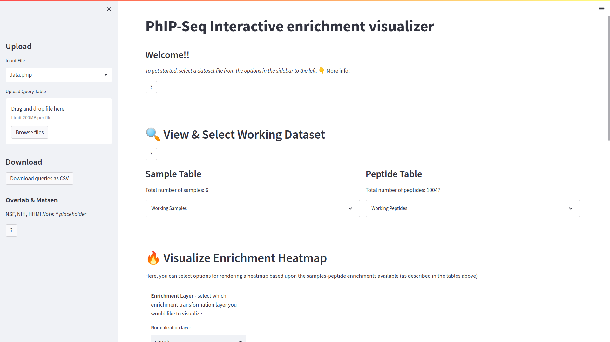
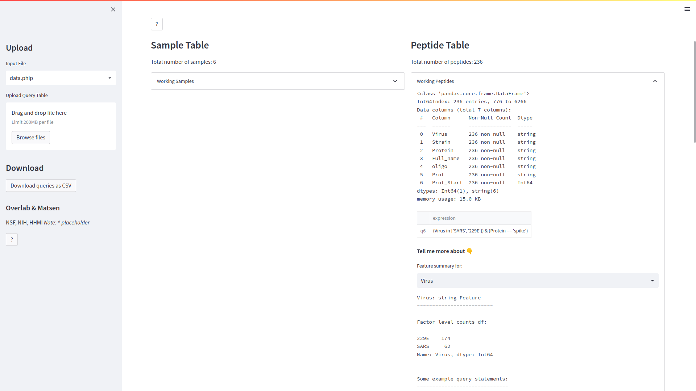
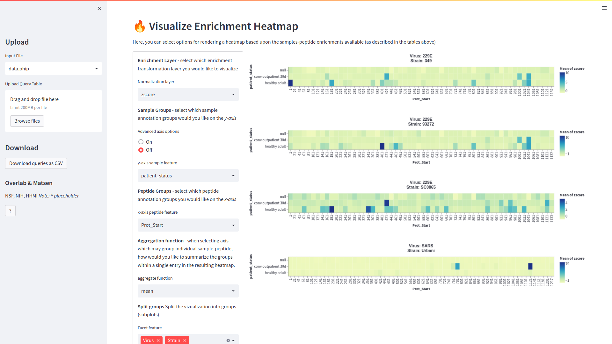

.. _sec_streamlit_app:

=================
Streamlit Viz App
=================

For convenience, we have created a simple 
`streamlit <https://streamlit.io/>`_ application for viewing a ``phippery``
dataset (i.e. "data.phip") as 
`altair heatmaps <https://altair-viz.github.io/gallery/simple_heatmap.html>`_.
The application allows you to subset you data based upon annotations that 
were in the sample or peptide tables (see :ref:`pipeline inputs <sec_pipeline_inputs>`).

To use the application on the :ref:`example Pan-CoV dataset <sec_clone_template>`,

.. code-block:: bash
 
   » docker run -p 8501:8501 -v $PWD:/app/data/ quay.io/matsengrp/phip-viz

Your default browser will then open the application and look something like this
at ``http://0.0.0.0:8501``

As a quick example, click on the expander drop bar on the right side, labeled 
"Working Peptides" under ``Peptide table``,
This will show us a brief overview of the peptides in our dataset for reference, or to 
add queries that will narrow the scope of our visualizations to a smaller subset.
Notice that the application gives some helpful suggestions based upon the data available.

We'll start by looking at only peptides from the spike protein of SARS-CoV-2 and 229E 
viruses. To do this, type ``(Virus in ['SARS', '229E']) & (Protein == 'spike')`` in the entry box
denoted ``Peptide Query Condition``, and hit the ``<Enter>`` key. You'll 
notice the query and it's unique key (denoted starting with "q<n>") 
was added to the table. The query was applied to the working
dataset and you can now see the summary of peptides has changes accordingly.

Next, well scroll down to the ``Visualize Enrichment Heatmap`` section to look at our data.
Enter the following options to view the enrichments aggregated by sample type and locus.
The values used to populate the heat map may be conveniently chosen 
via a drop-down menu, under "Normalization".
The options available depend on the transformations stored in the input ``xarray`` (.phip)
file. For example, if using the .phip as output by the 
:ref:`alignments pipeline <sec_pipeline_outputs>`,
then you'll have the option to visualize; 
raw counts ("counts"),
counts per million ("cpm"), 
significant ``edgeR`` hits ("edgeR_hits), 
``edgeR`` lod fold change values ("edgeR_logfc"), 
or size factors ("size_factors") normalization.

And that's it! For other features such as saving images, uploading query tables, and more, 
click on and of the ``?`` boxes to explore the various options.
