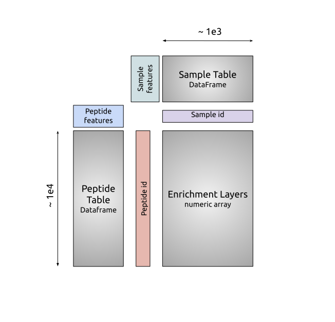

.. _sec_dev_intro:

=======
Gotchas
=======

.. _sec_missing_data:

Missing Annotations (i.e. NaN's)
^^^^^^^^^^^^^^^^^^^^^^^^^^^^^^^^

When dealing with missing values in the annotation tables, we use the 
`pd.convert_dtypes <https://pandas.pydata.org/docs/reference/api/pandas.DataFrame.convert_dtypes.html>`_
function to best allow for missing annotations, while maintaining the integrity of
the inferred datatype. It is highly recommended you stay consistent with datatype for feature annotations,
i.e. try not to mix values like ``1`` (integer), ``6.7`` (float), and ``hello_world`` (string) in any one of the columns. 
For missing data of any type, 
The following values will be interpreted as ``NaN``:

::

  ‘’, ‘#N/A’, ‘#N/A N/A’, 
  ‘#NA’, ‘-1.#IND’, ‘-1.#QNAN’, ‘-NaN’, ‘-nan’, ‘1.#IND’, ‘1.#QNAN’, ‘<NA>’, 
  ‘N/A’, ‘NA’, ‘NULL’, ‘NaN’, ‘n/a’, ‘nan’, ‘null’.

.. _sec_contribute:

============
Contributing
============

We welcome and encourage contributions to the pipeline.
We recommend following the same instructions
as `tskit <https://tskit.dev/tskit/docs/stable/development.html#sec-development-workflow-git>`_
for submitting a `pull request <https://github.com/matsengrp/phip-flow/pulls>`__.

Phippery Development Install
^^^^^^^^^^^^^^^^^^^^^^^^^^^^

For activate development, and documentation, we recommend using the following
instructions inside of a virtual environment or equivalent.

::

  » git clone https://github.com/matsengrp/phippery.git
  » (cd phippery && pip install -e ".[dev]")

Next, run the tests to make sure everything is working properly.

::

  » (cd phippery && pytest -vv)

PyPI
^^^^

This process will most likely be handled by the
maintainers of the project after a PR has been approved
and merged into main.

Update the version:
::

    bumpver update --patch

::

    For small changes, use ``--patch``
    For minor changes, use ``--minor`` 
    For major changes, use ``--major`` 

Build the wheel
::

    python -m build

Use Twine to check
::

    twine check dist/*

Optionally, Use Twine to upload to testpypi
::

    twine upload -r testpypi --verbose dist/* 

Building Documentation
^^^^^^^^^^^^^^^^^^^^^^

To edit the documentation seen here,
simply edit the respective ``.rst`` file 
(following the git workflow described below) 
in the ``docs/`` subdirectory. Once edited, you can check 
the edits are rendered correctly by building the docs locally

::

  » cd docs/
  » make clean && make html

Then open the index file built at ``_build/html/index.html``
with a browser of choice to inspect changes.

Once the changes have been approved and merged into the main branch
the documentation will automatically build and deploy.

.. _sec_under_the_hood:

The Data Structure
^^^^^^^^^^^^^^^^^^

The primary data structure resulting from PhIP-Seq experiments is an *enrichment matrix*, 
X, with i rows and j columns. 
Commonly, row index represents a peptide that is displayed on a phage,
and each column represents a sample that was mixed with the entire phage library. 
After sequencing and demultiplexing each sample, we align the reads to the 
oligonucleotide reference library to observe a
count of aligned reads to each peptide.

Outside of the enrichment matrix, each *sample* in an experiment as well as each *peptide*
in the phage library used have number of important annotations required when
performing analysis tasks like model fitting, normalizing, and differential selection.
Additionally, the comparison across groups of virus proteins and 
sample types is crucial in many experiments. For large sample size experiments, 
it can be difficult to cross reference each of these groups before and
after analysis. 

Here, we take advantage of the powerful 
`xarray <http://xarray.pydata.org/en/stable/index.html>`_
approach to organizing all the Phip-Seq data along four primary coordinate 
dimensions which tie all sample/peptide enrichments to the respective annotations. 
Doing this allows us to store all the information without the error prone 
step of cross-checking separate dataframes, and without the
large storage scaling of using "Tall" dataframes.

  **Xarray Dataset Format** A cartoon representation
  of the format output by the pipeline for 
  we require for using phippery functions.
  Concretely, for a matrix, `\mathcal{M}_{i}{j}` 
